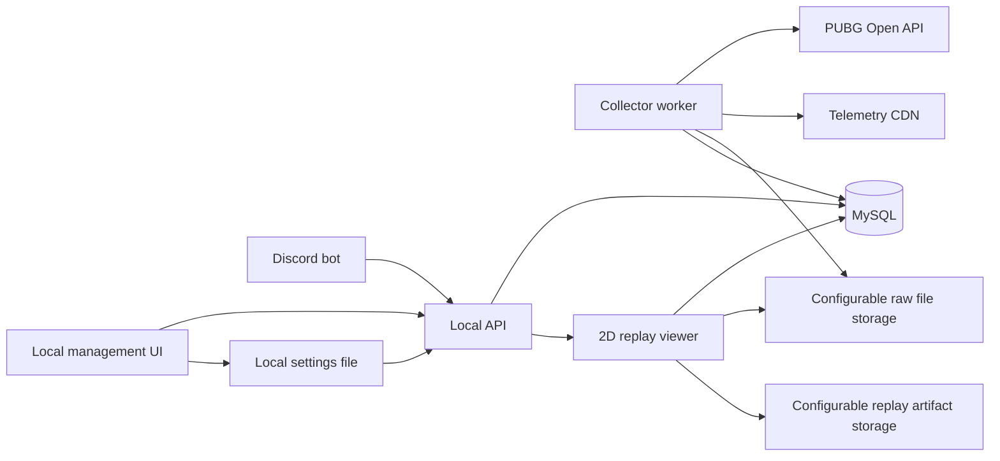

# Local Architecture and MySQL Model

Research date: 2026-06-27

## Target Shape

The system should run entirely on the local computer:

- MySQL for durable storage
- A local backend API for management UI and Discord command reads
- A worker/queue process for PUBG API polling, match download, telemetry parsing, and aggregation
- A Discord bot as the main user-facing interface
- A local web management app for player registration, job status, dashboards, and 2D replay playback
- A configurable raw-data storage directory for large match and telemetry files, preferably on a separate drive
- A configurable replay artifact directory for generated 2D timelines, map snapshots, thumbnails, GIFs, videos, and
  caches
- A local settings file managed by the UI so storage paths can be changed without editing `.env`

## Recommended Runtime

Python is a strong first choice because the requested analytics work is event-heavy and Python has mature data
tooling. A good local stack would be:

- FastAPI for local API
- discord.py or py-cord for Discord
- SQLAlchemy + Alembic for MySQL schema
- APScheduler, Celery, RQ, or a simple MySQL-backed job queue for polling
- Pydantic for event parsing
- Leaflet, PixiJS, or Canvas in the local UI for 2D replay

TypeScript/NestJS is also viable, especially if Discord + local web UI are both written in Node. If choosing
TypeScript, `pubg-kit` is the most relevant current SDK reference because it includes rate limiting, caching, and
NestJS integration.

## Component Diagram

## Data Storage Principle

Use a two-layer storage model:

1. Raw immutable layer
   - Store large raw match and telemetry JSON files under `PUBG_RAW_DATA_DIR`.
   - Keep request metadata, relative file path, source URL, fetched timestamp, parse version, and checksum in MySQL.
   - This protects the project from API retention limits and parser mistakes.

2. Normalized analysis layer
   - Extract core entities and event facts for fast queries.
   - Keep derived aggregates separate and rebuildable.

## Core Tables

### Registration and Identity

| Table | Purpose |
| --- | --- |
| `registered_players` | Admin-managed tracking targets: `account_id`, `current_name`, required `shard`, `active`, `public_profile` |
| `player_aliases` | Nickname history and lookup evidence |
| `discord_users` | Discord user records; not assumed to own PUBG accounts |
| `discord_guilds` | Guild-specific settings, ranking scope, and visibility defaults |
| `discord_permission_grants` | Global and guild-scoped per-user command group permissions |
| `global_admins` | Discord users allowed to manage and view all guilds |
| `player_groups` | Optional friend/group labels for squad analysis |
| `code_translation_overrides` | Admin-maintained Korean labels for new or corrected PUBG codes |

### Raw API Storage

| Table | Purpose |
| --- | --- |
| `api_fetch_jobs` | Queue and retry state for player/match/telemetry fetches |
| `raw_player_snapshots` | Raw player endpoint responses; small enough for MySQL JSON storage |
| `raw_match_payloads` | Raw match JSON file metadata by `match_id` |
| `raw_telemetry_payloads` | Raw telemetry JSON file metadata by `match_id` |
| `replay_artifacts` | Generated 2D replay timeline, map snapshot, thumbnail, GIF, video, and cache metadata |
| `parse_runs` | Parser version, status, error, and row counts |

### Match Facts

| Table | Purpose |
| --- | --- |
| `matches` | `match_id`, shard, map, mode, match type, team mode, perspective, ranked/custom flags, created KST time, duration, telemetry URL |
| `match_rosters` | Teams/rosters, rank, win flag |
| `match_participants` | Player match stats from match object |
| `player_match_summaries` | One row per tracked player per match with final stats and derived flags |
| `match_teammates` | Teammate pairs/trios/squad membership from PUBG roster/team data |
| `player_collection_states` | Polling cursor/status by registered player |
| `collector_settings` | Program-editable polling interval, cycle player limit, and lookup chunk size |
| `discord_permission_settings` | Program-editable command groups, guild-scoped grants, and global admins |

### Telemetry Event Facts

| Table | Purpose |
| --- | --- |
| `telemetry_events` | Generic event index: event type, timestamp, elapsed time, actor, raw payload JSON |
| `item_events` | Pick/drop/use/equip/unequip/attach/detach/trunk/carepackage/lootbox events |
| `loadout_snapshots` | Reconstructed weapon + attachment state over time |
| `weapon_fire_events` | Attack, throwable, flare, fire-count events |
| `damage_events` | Damage dealt/taken with causer, reason, distance, armor notes |
| `dbno_events` | Knockdown episodes keyed by `dBNOId`, including attacker, victim, weapon, distance, and revive/final state |
| `fight_outcomes` | Per-player fight outcomes such as `dbno_win`, `dbno_loss`, `final_kill`, and `final_death` |
| `kill_events` | Final kill/death/finish/assist/teamkill/suicide records |
| `revive_events` | Revive and redeploy events |
| `position_samples` | Player position samples for movement, drop, route, and replay |
| `vehicle_events` | Ride/leave/damage/destroy/wheel events |
| `zone_events` | Game state, phase, bluezone/redzone/blackzone signals |
| `care_package_events` | Care package spawn and landing points |
| `landing_events` | Parachute landing and first-grounded position |

## Derived Aggregate Tables

| Table | Purpose |
| --- | --- |
| `agg_player_daily` | Daily KDA, damage, wins, maps, modes, play volume |
| `agg_player_monthly` | Monthly trend rollups |
| `agg_player_weapon` | Weapon usage, kills, deaths, damage, assists, caused DBNOs, suffered DBNOs, fight wins/losses |
| `agg_weapon_distance_bucket` | Weapon outcomes by distance bucket |
| `agg_weapon_attachment` | Weapon + attachment combination outcomes |
| `agg_player_map` | Map-specific performance and drop preference |
| `agg_player_teammate` | Performance with each teammate or party set |
| `agg_player_drop_zone` | Common landing/drop coordinate clusters and outcomes |
| `map_region_labels` | Phase-2 mapping from coordinate clusters to named regions |
| `recommendation_scores` | Rebuildable player/global recommendation outputs |

### Code Translation

Known PUBG internal codes should be translated before UI/Discord display. Unknown codes are stored and displayed
unchanged so newly added PUBG content remains visible.

## MySQL Implementation Notes

- Use `utf8mb4` for all text.
- Store small player snapshots in MySQL `JSON` columns.
- Store large match and telemetry JSON payloads as compressed files under `PUBG_RAW_DATA_DIR`.
- Store generated 2D replay artifacts and static map images under `PUBG_REPLAY_DATA_DIR`.
- Store only metadata for large raw files in MySQL: root key, relative path, compression, file size, `sha256`,
  source URL, fetched timestamp, and parser version.
- Store replay artifact metadata in MySQL: artifact type, content type, relative path, size, `sha256`, generated
  timestamp, and renderer version.
- Keep file paths relative to `PUBG_RAW_DATA_DIR` or `PUBG_REPLAY_DATA_DIR` so drives can be moved without rewriting
  every row.
- Do not silently fall back to the project directory if a configured external drive is missing.
- Load storage paths from `config/local_settings.json` when the local program has saved user-selected paths.
- Keep `PUBG_API_KEY` and `DISCORD_BOT_TOKEN` only in `.env`; local settings must not store raw secrets.
- Scope Discord permissions/rankings by `guild_id`, with global admins allowed to view/manage all guilds.
- Treat registered PUBG players as tracking targets, not Discord ownership claims.
- Use `match_id` and `account_id` as natural keys where possible.
- Use bigint surrogate IDs for high-volume event tables.
- Add indexes on:
  - `registered_players(account_id, shard)`
  - `matches(created_at, map_name, game_mode)`
  - `match_participants(account_id, match_id)`
  - `telemetry_events(match_id, event_type, event_ts)`
  - `position_samples(match_id, account_id, elapsed_time)`
  - `damage_events(attacker_account_id, victim_account_id, match_id)`
  - `dbno_events(attacker_account_id, victim_account_id, match_id)`
  - `fight_outcomes(account_id, match_id, outcome_type)`
  - `kill_events(killer_account_id, victim_account_id, match_id)`
- Store normalized DB timestamps in KST and use KST calendar boundaries for daily/monthly aggregates.
- Preserve source API timestamps separately when useful for debugging.

## 2D Replay / Near-Live Viewer

Because the official API exposes telemetry after match discovery, implement this as a replay-first feature:

Match details and telemetry are only available after the PUBG match finishes, so 2D replay is not in-match live
tracking.

1. Parse `LogMatchStart` to identify map and team size.
2. Load the map image or coordinate metadata from official assets or project-maintained map assets.
3. Use `LogPlayerPosition` as the primary track source.
4. Interpolate positions between samples for smooth playback.
5. Overlay fight events:
   - damage lines
   - DBNO marker
   - DBNO fight win/loss marker for tracked players in duo/squad modes
   - kill marker
   - revive marker
   - care package marker
   - blue zone phase rings if coordinates are available
6. Add player/team filters for registered users and squad members.
7. Add playback controls: speed, seek, follow player, show weapons, show damage, show deaths.

## Static Map Snapshot Rendering

Generate JPEG or PNG map snapshots after telemetry parsing so Discord can show a fast visual summary without opening
the full replay UI. Use artifact type `map_snapshot` in `replay_artifacts`.

Recommended snapshot layers:

| Layer | Source |
| --- | --- |
| Plane route | Flight/aircraft path reconstructed from early position and phase events when available |
| Parachute route | `LogPlayerPosition` samples before first grounded/landing event |
| Movement route | `LogPlayerPosition` samples after landing, optionally simplified for readability |
| Landing point | `LogParachuteLanding` or first grounded player position |
| Kill and DBNO points | `LogPlayerKillV2` and `LogPlayerMakeGroggy` locations |
| Death point | victim location from `LogPlayerKillV2` or final participant location fallback |
| Care packages | `LogCarePackageSpawn` and `LogCarePackageLand` |
| Phase circles | `LogGameStatePeriodic` safe-zone/blue-zone data where coordinates are present |

Suggested outputs:

| File | Purpose |
| --- | --- |
| `match-route-summary.jpg` | Whole-match overview for Discord match summary |
| `player-{account_id}-route.jpg` | One tracked player's plane/drop/movement/fight/death view |
| `team-{team_id}-route.jpg` | Registered squad/team route and fight summary |

Renderer output should include a small legend and KST match timestamp, but raw secret values and Discord IDs must not
appear on the image.

For Discord, do not stream the whole replay. Send a summary image/GIF or a local UI link when the local app is open.

## Discord Command Ideas

| Command | Result |
| --- | --- |
| `/pubg-register nickname shard` | Register nickname and required platform shard; permission-gated |
| `/pubg-profile nickname` | KDA, recent matches, favorite weapons/maps |
| `/pubg-recent nickname` | Recent match summaries |
| `/pubg-match match_id` | Match summary with chicken/non-chicken and team stats |
| `/pubg-weapon nickname weapon` | Weapon-specific kills, damage, death, distance, attachment stats |
| `/pubg-recommend nickname` | Recommended weapons and attachments |
| `/pubg-team nickname` | Best teammate combinations |
| `/pubg-map nickname` | Map performance and drop tendency |
| `/pubg-replay match_id` | Local 2D replay link or rendered summary |
| `/pubg-ranking scope` | Server-wide rankings |
| `/pubg-permission user group allow` | Grant or revoke command group permissions; admin-only |
| `/pubg-unregister nickname shard` | Stop future collection and retain existing data by default; admin/delegated-only |

The same permission groups and per-user grants must be editable in the local management program.

Team membership should come from PUBG roster/team data. Registered teammates should be visually emphasized in local
UI and Discord responses.

## First MVP Milestone

The first useful milestone should avoid heavy AI and focus on trustworthy data:

1. MySQL migrations for core/raw tables.
2. Player registration and account ID lookup.
3. Match discovery for registered users only.
4. Match and telemetry download.
5. Parser for P0 telemetry events.
6. Match summary and weapon summary aggregates.
7. Discord commands for register, recent, profile, weapon.
8. Local management page for registered players, job status, and raw match drill-down.
